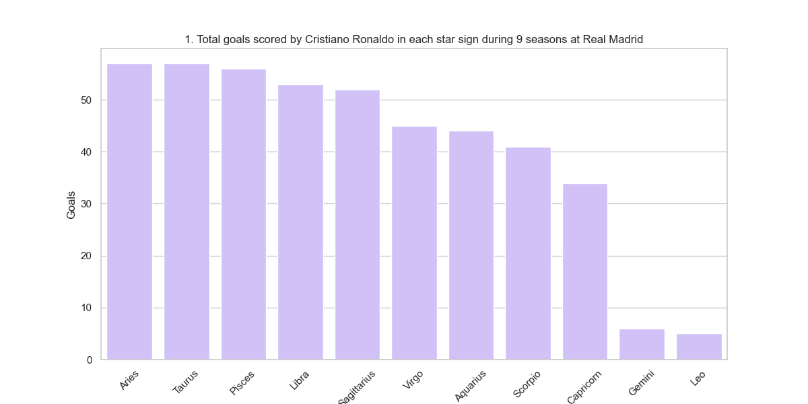
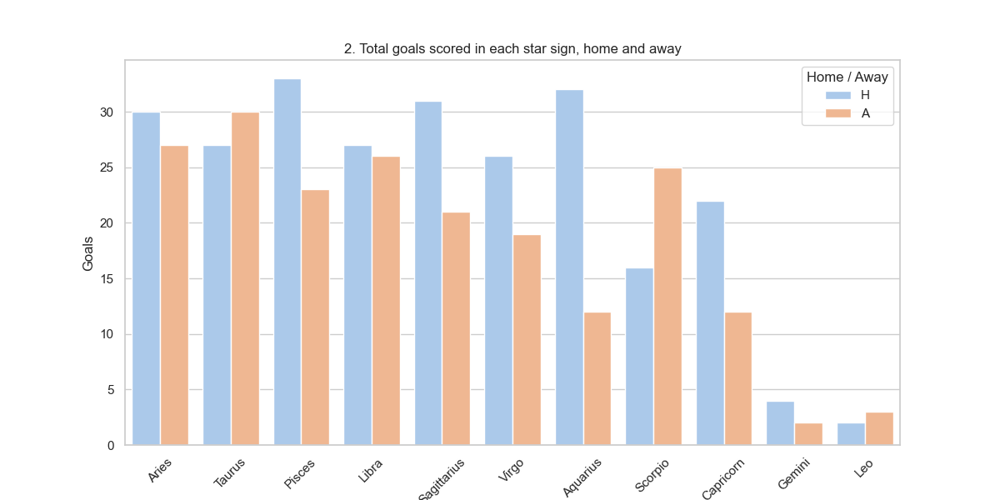
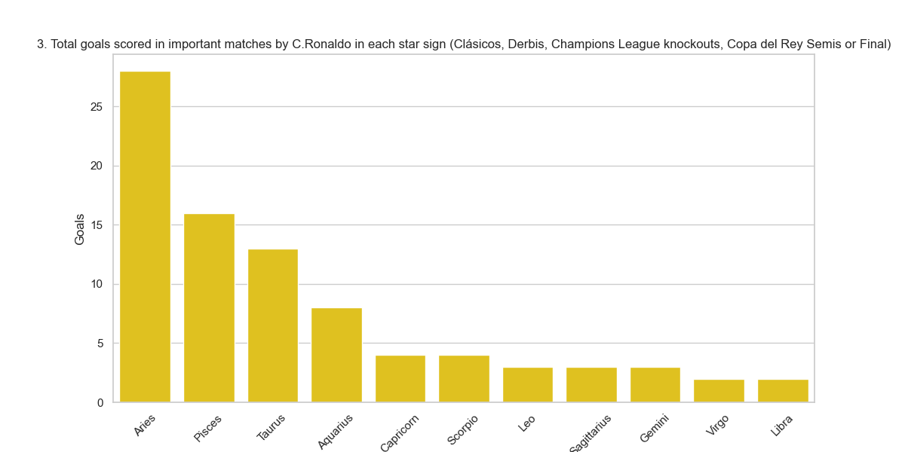
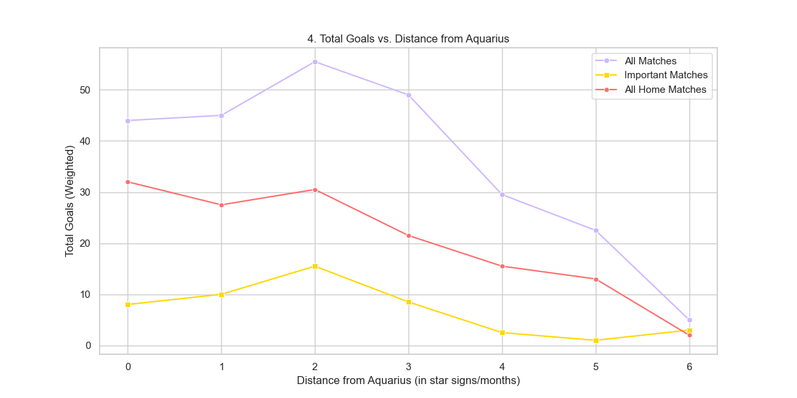

# Project II - Did Cristiano Ronaldo perform better for Real Madrid when the sun was in his astrological sign? #

## Edu Rodger ## 

### Ironhack ###

### Overview ###

The goal of this project is to use an existing dataset, transform it using web scraping or APIs, and use the extended data set to answer a series of questions on a theme of our choice. I have chosen to look at Cristiano Ronaldo's goals at Real Madrid, and whether or not his performance was affected by the sun being in (or close to) his astrological sign, Aquarius.

Link to presentation: 

### Requirements and libraries ###

Code was written in Python using Jupyter Notebook and Visual Studio Code. The dataset was downloaded from Kaggle. Libraries used:
    - Numpy
    - Pandas
    - Matplotlib
    - Seaborn
    - Requests
    - Datetime
    - Dateutil
    - BeautifulSoup
    - URLopen

### Questions ###

    1. Did Cristiano Ronaldo score more goals while the sun was in Aquarius compared to when the sun was in other astrological signs during his time at Real Madrid? 
    2. Did playing home or away matches affect the influence of astrology on Ronaldo's performance? Was astrology more influential when he played at home, or away, or did it not make a difference?
    3. How did astrology affect his performances in his most important matches?
    4. Is there any relationship or correlation between how far the sun was from Aquarius, and Ronaldo's performance? Did he tend to score more in the months closest to Aquarius? And does this change when looking at home vs away games, or at his most important games?

### Workflow ###

The dataset was obtained from Kaggle, and due to its amazing readability, very little cleaning needed to be done. It is a dataset containing every goal Cristiano Ronaldo has scored at club level. Each row represents a goal. It was filtered down to include only matches for Real Madrid, and columns not relevant to the project (such as who assisted each goal, or a description of the goal, minute in the match etc) were removed. Date formats were standardised as mm-dd. 

Using an API to determine the astrological sign corresponding to any given date in the past was the original plan. After using an astronomy API, it became evident it needed more complex and detailed information than what I had. As with most astronomy-related APIs, the API didn't really match the scope of the project, so I decided to webscrape instead. I webscraped the wikipedia page on astrological signs, and produced a dictionary with the zodiac signs as keys, and tuples containing the start and end date of each sign as the values.

Combining the dataset and the dictionary obtained from webscraping, 2 new columns were added to the dataset - 'Star Sign' and 'Distance from Aquarius', corresponding to the star sign of the date of the goal scored, and to the distance (in terms of signs, or months) of that sign from Aquarius (Ronaldo's sign). The distances ranged from 0 to 6, considering the 'closer' months to be the ones closest before and after Aquarius. For example, Pisces and Capricorn are both 1 sign away from Aquarius, etc. 

Using Seaborn and Matplotlib, the graphs displayed below were plotted to answer the questions above. 

### Limitations ###

Firstly, I recognise quantifying Ronaldo's performance would have been more accurate measuring goals per game, rather than total goals. This would have accounted for things such as nearly no matches being played in the summer, or more matches being played in the spring (especially during a successful season when a team stays in all 3 competitions until the latter stages). Calculating goals per game would have required either using a different dataset or merging this one with one that also contained all matches played by Ronaldo in Real Madrid where he *didn't* score. I have purposefully used plots where this isn't too misrepresentative, such as bar plots where all the signs can be seen. 

Secondly, the line plot (Figure 4) contains the total number of goals scored for the signs with distances 0 and 6 from Aquarius (i.e. Aquarius and Leo), while the total goals in every other value (distances 2, 3, 4, and 5 from Aquarius) are divided by 2 so as to take the *average* number of goals scored across the two months in which the astrological sign is that many signs (or months) away from Aquarius. For example, both Scorpio and Taurus are 3 signs/months (before and after) away from Aquarius, so the total at value 3 is an average value, calculated by dividing the sum of goals scored in Scorpio and Taurus by 2. This is to weight the results where there is twice as much data, in order to show a more accurate line, considering the y axis is a count of goals. I recognise this is probably an imperfect way of weighting the results, but I believe it was the more efficient way of producing a more accurate plot. 

### 1. Did Cristiano Ronaldo score more goals while the sun was in Aquarius compared to when the sun was in other astrological signs during his time at Real Madrid? ###

As we see in the figure, Cristiano Ronaldo did not particularly score more goals while the sun was in Aquarius. The figure shows us Aries, Taurus and Pisces were the signs in which Ronaldo scored most goals. Aquarius, when looking at total number of goals, actually seems to be among the lowest scoring star signs for Ronaldo. 

Provisional conclusion: Ronaldo did not score more goals during his star sign while he was at Real Madrid.

### 2. Did playing home or away matches affect the influence of astrology on Ronaldo's performance? Was astrology more influential when he played at home, or away, or did it not make a difference? ###

This graph shows the same data as figure 1, except the bars are split by home and away matches. While the overall pattern looks similar, it is noticeable that the goals in home matches is particularly high for Aquarius, while the away goals in that sign are very low. It is the sign with the least consistency across home and away matches, and we can see that if you look at home matches, Aquarius actually is one of Ronaldo's highest scoring signs. 

Provisional conclusion: Ronaldo seems to have scored more goals than usual while the sun was in Aquarius, when you are looking at data from his matches at home, at the Santiago Bernabeu. This will be explored more in question 4.

### 3. How did astrology affect Ronaldo's performances in his most important matches? ###

This graph is also based on the same data as question 1, but this time the data is filtered to only include 'important' matches, which I have defined as; rivalries (vs Barcelona and Atlético de Madrid), knockout matches in the Champions League, and semi-finals and finals of the Copa del Rey. 

As we can see from the figure, looking at data from important matches accentuates the dominance of Aries, Pisces and Taurus as Ronaldo's strongest star signs in which to score goals. Much like in question 1, this shows us that Ronaldo was not more prolific when the sun was in his star sign.

### 4. Is there any relationship or correlation between how far the sun was from Aquarius, and Ronaldo's performance? Did he tend to score more in the months closest to Aquarius? And does this change when looking at home vs away games, or at his most important games? ###

This graph shows how Ronaldo's goal tally changes as the months get further from his star sign, the furthest month being Leo, the closes months being Pisces and Capricorn. 

Overall, the graph shows that while his highest scoring months are close to Aquarius (Aries, Taurus, Pisces), there isn't an overall correlation to say that the further away the sun was from his star sign, the less he would score. This is due to the comparatively low values in Aquarius. 

We can also recognise that the low values on the other end of the graph, at values 5 and 6, are due to the low amount of matches (if any) being played in the summer, when we are 5 or 6 months away from Aquarius. 

However, an interesting observation can be made about home games. When looking only at home games, we can see that there is indeed a general downward trend in goals scored as we get further from Ronaldo's star sign. 

Therefore, when looking at matches only in the Santiago Bernabeu, we can say that Ronaldo was more prolific the closer the months got to his astrological sign, Aquarius. Clearly, the cosmic powers increased his goalscoring prowess at the Bernabeu. 

### Conclusions ###

Overall, Ronaldo scored most goals when the sun was in Aries, Pisces and Taurus. There is no general pattern to say that he scored more or was better when playing closer to or during his astrological month, Aquarius (20th January - 18th February).

However, when we look at the data only from home games, not only can we see that Aquarius one of the highest scoring star signs, we can also observe a general trend showing that Ronaldo scored more goals in the time around Aquarius season.  